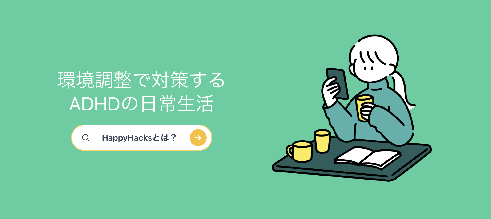

HappyHacksは、ADHDにありがちな困りごとの対策をシェアして、より良い環境調整を自分の生活に取り入れるためのサービスです。

### サービスURL
https://www.happyhacks.app/

 

## サービス紹介

### スマホ操作UI (ユーザーはスマホ利用を想定しているため)
https://github.com/tak-eru/happyhacks/assets/95963718/ce0ec789-ba7d-49ad-beea-3105bd922d9d

### 主な機能
- 対策・投稿・回答の一覧、詳細
- 検索機能
- ユーザー機能
    - ログイン、ログアウト、新規登録
    - プロフィール編集
    - プロフィール画像の編集
    - 対策・回答へのブックマーク、いいねの作成
    - ブックマーク一覧
    - 対策の投稿、編集、削除
    - 投稿した対策一覧
    - 質問の投稿、編集、削除
    - 投稿した質問一覧
    - 質問への回答、編集、削除
    - 質問への回答一覧

### 意識した点
#### UX / パフォーマンス
- 「いいね」や「ブックマーク」のボタンをマイクロインタラクションとして実装する。
- ロードが重い場合に体感を軽くするために、プログレスバーを表示する。
- 静的なページはSSG（静的サイトジェネレータ）を使用し、OGPが必要な箇所はSSR（サーバーサイドレンダリング）を使用する。
- 画像の高さ設定やスケルトンローディングなどを利用して、レイアウトシフトを最小限に抑える。
- ブラウザのバックボタンを押した場合にスクロール位置を保存する。
- ブラウザのバックボタンを押した場合に、前回開いていたタブを復元する。
- 画像ファイルは可能な限りwebpなどの形式に変換して圧縮する。
- 投稿の文字数が多い場合には一覧にすべて表示せず、「...もっと見る」などの方法で対応する。
- 詳細ページから投稿を閲覧したままコメントやブックマークを行えるよう、リダイレクトを必要とせずにログインできるようにする。

#### スマホ対応
- レスポンシブデザインに対応する。
- ボタンの配置をPCレイアウトと異なるものに変更し、操作しやすい下部に配置。
- 画面幅いっぱいに文字を詰め込むと目が疲れるため、右側に80%くらい寄せる。
- 検索時に改行ではなく、「検索」という表示がキーボードに表示され、入力フィールドが表示されるようにする。
- 検索ボタンを押した場合にキーボードを閉じるなど、UXの面を考慮する。
- ボタンのサイズなどが小さすぎて操作しづらくないかを確認する。

#### アクセシビリティ
- フォントと背景色のコントラスト比をチェックツールを使用して適切なレベルに保つ。
- キーボードでの遷移が適切に行えるかを確認する。
- alt属性を適切に設定する。

## 使用した技術

### フロントエンド
- Next.js 13.2.4
- React 18.2.0
- TypeScript 4.9.4
- Tailwind CSS 3.2.4
- Mantine 5.9.4

#### 主要なライブラリ
- @auth0/auth0-react 2.0.0
- @next/font 13.2.4
- jotai 2.0.2
- next-seo 5.15.0
- swr 2.0.0
- axios 1.2.1
- dayjs 1.11.7
- @lottiefiles/react-lottie-player 3.5.2
- react-icons 4.7.1
- @vercel/og 0.5.0
- eslint 8.38.0
- prettier 2.8.7
- postcss 8.4.20

### バックエンド
- Rails 6.1.7 (APIモード)
- Ruby 3.1.3

#### 主要なgem
- rack-cors
- jwt
- annotate

### インフラ
- AWS (ECS / Fargate ECR ALB RDS(PostgreSQL) CloudWatch S3 Route53 SSM VPC)

### 外部サービス、その他
- Auth0
- Google Domains
- LottieFiles